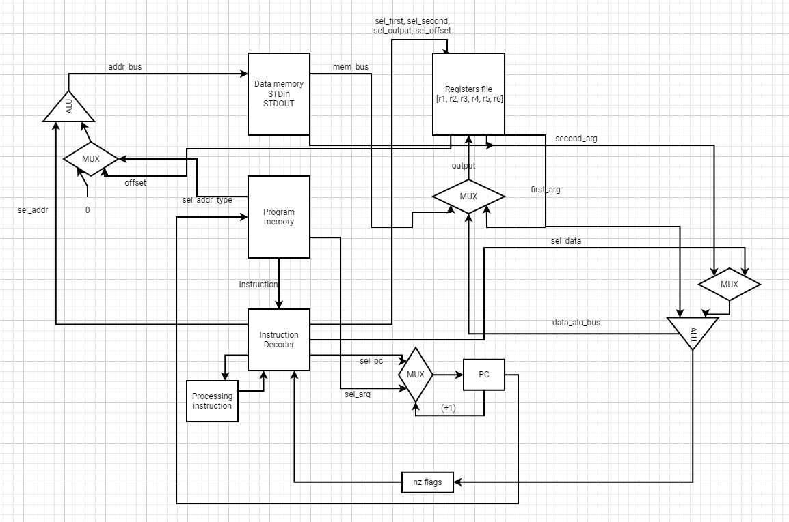

# Лабораторная работа №3 "На кончиках пальцев".

- Погрибняк Иван Сергеевич, гр. Р33131
- `asm | risc | harv | hw | instr | struct | stream | mem | prob5`
- Упрощенный вариант

## Язык программирования

```ebnf
program ::= <section_data> <section_text>

<section_data> ::= "section data\n" <declaration>

<section_text> ::= "section text\n" <instructions>

<declaration> ::= (<variable> | (<number> | <string>))

<instructions> ::= (<label> | <command>)

<name> ::= [a-zA-Z0-9]+

<label> ::= "."<name> ":"

<variable> ::= <name> ":"

<reg=> ::= "r1" | "r2" | "r3" | "r4" | "r5" | "r6"

<string> ::= "<ASCII symbol>+"

<number> ::= [-2^64; 2^64 - 1]

operation_2_args ::= ("CMP" | "LD" | "ST" | "MOV" | "ADD" | "SUB" | "MUL" | "DIV" | "MOD") " " ((<reg> " " <reg>) | (<reg> " " "!" <name>) | ("!" <name> " " <reg>) | (<reg> " " "(" <name> "|" <reg>))

operation_1_arg ::= ("JMP" | "JZ" | "INC" | "DEC") " " (<label> | <reg>)

operation_0_args ::= "HLT"

<command> ::= <operation_2_args> | <operation_1_arg> | <operation_0_args>
```

Поддерживаемые аргументы:

- **регистр** - `@r1`. Всего регистров 5 штук: r1, r2, r3, r4, r5.
- **метка** - `label:`.
- **адрес памяти** - `!name`. Прямое обращение к переменной или стандартным потокам
- **относительная** - `(name|offset)`. В качестве offset передается регистр с необходимым значением.
- **строка** - `'drainshawty'`. Транслируется в последовательность кодов ASCII, заканчивающейся символом "\0".
- **целое число** в диапазоне [-2^64 ; 2^64 - 1].

Виды операций:

- **REGISTER** операция - может использовать в качестве операндов регистры, значения (символ, число). Первые операнды (до предпоследнего) регистры.
- **BRANCH** операция - может поддерживать метки в качестве операндов. Должна иметь 1 операнд-метку.
- **MEM** операция - может поддерживать адреса и имена переменных в качестве операндов. Один из операндов должен быть регистром

Код находится в `section text` и выполняется последовательно. Виды операций:

- `MOV <arg1> <arg2>` -- скопировать значение `<arg2>` в `<arg1>`. **REGISTER** операция.
- `ADD <arg1> <arg2>` -- прибавить к `<arg1>` `<arg2>`, результат поместить в `<arg1>`. **REGISTER** операция.
- `SUB <arg1> <arg2>` -- вычесть из `<arg1>` `<arg2>`, результат поместить в `<arg1>`. **REGISTER** операция.
- `CMP <arg1> <arg2>` -- результат сравнения `<arg1>` с `<arg2>`. **REGISTER** операция.
- `MUL <arg1> <arg2>` -- произведение `<arg1>` на `<arg2>`, результат поместить в `<arg1>`. **REGISTER** операция.
- `DIV <arg1> <arg2>` -- целая часть от деления `<arg1>` на `<arg2>`, результат поместить в `<arg1>`. **REGISTER** операция.
- `MOD <arg1> <arg2>` -- остаток от деления `<arg1>` на `<arg2>`, результат поместить в `<arg1>`. **REGISTER** операция.
- `LD <arg1> <arg2>` -- загрузить в `<arg1>` `<arg2>`. `<arg2>`может выступать только именем ячейки (возможно со смещением), `<arg1>` может выступать только регистром. **REGISTER** операция, **MEM** операция.
- `ST <arg1> <arg2>` -- загрузить `<arg2>` в `<arg1>`. `<arg1>` может выступать только именем ячейки (возможно со смещением), `<arg2>` может выступать только регистром. **REGISTER** операция, **MEM** операция.
- `INC <arg>` -- инкрементировать операнд (+1). Может иметь в качестве операнда только регистр. **REGISTER** операция.
- `DEC <arg>` -- декрементировать (-1) операнд. Может иметь в качестве операнда только регистр. **REGISTER** операция.
- `JMP <label>` -- безусловный переход на аргумент-метку. **BRANCH** операция.
- `JZ <label>` -- если результат предыдущей операции равен 0, перейти на аргумент-метку. **BRANCH** операция.
- `HLT` -- завершить выполнение программы.

Переменные объявляются в `section data` и имеют такой синтаксис - `<var>: <value>`:

- `<var>` - имя переменной. Case-sensitive. Имя не должно иметь пробелов и должно заканчиваться символом `:`
- `<value>` - значение переменной. Может быть числом или строкой. Правила записи те же, что и для аргументов.
- Одна переменная должна располагаться на 1 строчке.

Дополнительные конструкции:

- `section text` - объявление секции кода.
- `section data` - объявление секции данных.
- `<label>:` - метки для переходов. Могут быть объявлены только в `section text`. Должны располагаться на отдельной строке.

Зарезервированные переменные:

- Имеют фиксированный адрес в памяти
- Возможно обратиться только напрямую (!STDIN | !STDOUT)
- При трансляции превращаются в их адрес
- Виды:
  - `STDIN` - при чтении переменной происходит ввод данных. В переменную нельзя записывать.
  - `STDOUT` - при записи в переменную происходит вывод данных. Из переменной нельзя читать.

Дополнительные сведения:

- Всега должна присутствовать `section text` - тело программы и `section data` - память программы.

## Организация памяти

- Объявления переменных в `section data`.

Модель памяти процессора:

- Память данных. Машинное слово -- 64 бит, знаковое. Реализуется через Python list. В ячейках лежать только числа.
- Число может быть представлено как код символа, так и как число (доступны любые операции).

Типы адресации:

- **REG**: операндом инструкции является регистр.
- **DATA**: операндом является константа, подаваемая как один из аргументов.
- **ABS**: операндом инструкции является переменная.
- **IDR**: операндом инструкции является переменная и смещение относительно нее.

## Система команд

### Особенности процессора:

- **Машинное слово** -- 64 бита, знаковое.
- **Память:**
  - адресуется через регистры `pс` и через шину данных `addr_bus`.
  - может быть прочитана в регистровый файл или в `Instruction Decoder`.
  - может быть записана из регистрового файла.
  - имеет зарезервированные ячейки для потоков ввода-вывода.
- **Регистровый файл**:
  - состоит из регистров размером с машинное слово.
  - всего регистров 6: r1, r2, r3, r4, r5, r6.
  - имеет два выхода и 1 вход: `first`, `second`, `output`. Устанавливаются при помощи сигналов `Instruction Decoder`.
  - регистр, подключенный к `output`, может быть записан из памяти, АЛУ (связанного с ним), регистра, подключенного к `first` или операндом из `Instruction Decoder`.
  - регистр, подключенный к `first` может быть прочитан в левый вход к АЛУ (подключенному к регистровому файлу) или в регистр, подключенный к `output`.
  - регистр, подключенный к `second` может быть прочитан в память или на правый вход АЛУ (подключенного к регистровому файлу).
- **АЛУ, соединенный с регистровым файлом**:
  - имеет 2 входа и 1 выход.
  - прозводит арифметические операции с регистрами и аргументами из `Instruction Decoder`.
  - управляется сигналами из `Instruction Decoder`.
  - устанавливает флаги нуля, положительного результата по результату вычисленной операции.
  - складывает, вычитает, умножает, делит, получает остаток от деления.
  - результат вычислений записывается в регистр.
- **АЛУ, соединенный со счетчиком команд**:
  - имеет 2 входа и 1 выход
  - прозводит арифметические операции с адресами и аргументами из `Instruction Decoder`. (либо сумма адреса и 0, либо сумма адреса и смещения для соответствующей адресации)
  - управляется сигналами из `Instruction Decoder`.
  - складывает, вычитает, умножает, делит нацело, получает остаток от деления.
  - результат вычислений передается на шину `addr_bus`.
  - используется для вычисления смещения.
- **Instruction Decoder** -- декодировщик инструкций:
  - отвечает за декодирование и исполнение инструкций.
  - отправляет управляющие сигналы.
  - может читать инструкцию из памяти, флагов, установленных АЛУ.
- **Ввод-вывод** -- memory-mapped через резервированные ячейки памяти.
- **pс** -- счётчик команд.
  - инкрементируется после каждой инструкции или перезаписывается инструкцией перехода.

### Набор инструкций

Ограничения:

- число в диапазоне [-2^64 ; 2^64 - 1].
- адрес в памяти - адрес не должен выходить за пределы памяти.
- адрес со смещением не должен выходить за пределы памяти.
- регистр - должен находиться в регистровом файле.

| Синтаксис                         | Комментарий                                                                                            |
|:--------------------------------- |:-------------------------------------------------------------------------------------------------------|
| ADD/SUB/MUL/DIV/MOD/CMP/MOV `<arg> <arg>` |                                                                              |
| JMP/JZ `<arg>`                    | работают только с прямой адрисацией на метку.                                                          |
| INC/DEC `<arg>`                   |                                                                               |
| HLT                               | вызывает остановку симуляции                                                                           |
| LD `<arg> <arg>`                  | Выполняет чтение из указанной ячейки памяти<br/>Поддерживает абсолютную и относительную адресации<br/> |
| ST `<arg> <arg>`                  | Выполняет запись в указанную ячейку памяти<br/>Поддерживает абсолютную и относительную адресации<br/>  |

### Кодирование инструкций

- Машинный код сериализуется в JSON.
- Один элемент -- одна инструкция.
- Инструкция имеет фиксированный размер - машинное слово

Пример:

```json
[{"index": 2, "instruction": "data", "arguments": [{"address_mode": "data", "data": 72, "offset": 0}, {"address_mode": "data", "data": 101, "offset": 0}, {"address_mode": "data", "data": 108, "offset": 0}, {"address_mode": "data", "data": 108, "offset": 0}, {"address_mode": "data", "data": 111, "offset": 0}, {"address_mode": "data", "data": 32, "offset": 0}, {"address_mode": "data", "data": 119, "offset": 0}, {"address_mode": "data", "data": 111, "offset": 0}, {"address_mode": "data", "data": 114, "offset": 0}, {"address_mode": "data", "data": 108, "offset": 0}, {"address_mode": "data", "data": 100, "offset": 0}, {"address_mode": "data", "data": 33, "offset": 0}, {"address_mode": "data", "data": 0, "offset": 0}]},
 {"index": 0, "instruction": "mov", "arguments": [{"address_mode": "register", "data": "r2", "offset": 0}, {"address_mode": "data", "data": 0, "offset": 0}]},
 {"index": 1, "instruction": "ld", "arguments": [{"address_mode": "register", "data": "r1", "offset": 0}, {"address_mode": "indirect", "data": 2, "offset": "r2"}]},
 {"index": 2, "instruction": "cmp", "arguments": [{"address_mode": "register", "data": "r1", "offset": 0}, {"address_mode": "data", "data": 0, "offset": 0}]},
 {"index": 3, "instruction": "jz", "arguments": [{"address_mode": "absolute", "data": 7, "offset": 0}]},
 {"index": 4, "instruction": "st", "arguments": [{"address_mode": "absolute", "data": 1, "offset": 0}, {"address_mode": "register", "data": "r1", "offset": 0}]},
 {"index": 5, "instruction": "inc", "arguments": [{"address_mode": "register", "data": "r2", "offset": 0}]},
 {"index": 6, "instruction": "jmp", "arguments": [{"address_mode": "absolute", "data": 1, "offset": 0}]},
 {"index": 7, "instruction": "hlt", "arguments": []}]
```

- `instruction_code` -- строка с кодом операции.
- `index` -- позиция инструкции в памяти.
- `arguments` -- аргументы инструкции:
  - `data` -- значение аргумента.
  - `address_mode` -- режим адресации аргумента.
  - `offset` -- везде 0 кроме команд с относительной адресацией (смещение).

Типы данных, реализованные в модуле: [isa.py](isa.py)

- `OperationCode` -- коды операций.
- `AddressMode` -- режимы аддресации:
  - `REG` -- аргумент является регистром. В поле `data` находится регистр.
  - `IDR` -- аргумент показывает относительную адресацию. В поле `data` находится адрес, а в `offset` смещение.
  - `ABS` -- аргумент показывает прямую адресацию. В поле `data` находится адрес.
  - `DATA` -- аргумент является значением. В поле `data` находится число.
- `Instruction` -- описание всей необходимой информации об инструкции.
- `Argument` -- структура для описания всей необходимой информации об аргументе

## Транслятор

Реализовано в модуле: [translator.py](translator.py)

Интерфейс командной строки: `./translator.py <input_file> <target_file>"`

Этапы трансляции (функция `translate`):

1. Препроцессирование исходного кода: удаление лишних пробелов, запятых, комментариев. Реализовано в методе `simplify_text`.
2. Разделение данных памяти и команд для разной обработки в методе `split_sections`. 
3. Преобразование `section data` в машинный код - функция `define_data`.
4. Преобразование `section text` в машинный код - функция `define_commands`.
5. Подстановка адресов переменных и меток - функция `linking`

Правила генерации машинного кода:

- один `Instruction` -- одна инструкция.
- вместо регистров подставляются их имена (enum `Register`).
- вместо адресов в памяти подставляются сами адреса или адреса зарезервированных ячеек.
- вместо меток подставляется адрес памяти команд, на которые они указывают.
- Каждая строка в памяти представляется как подряд идущие коды символов, конец строки - 0.
- вместо символов подставляются их ASCII коды.

## Модель процессора

### Схема DataPath и ControlUnit



### DataPath

Реализован в классе `DataPath` модуля: [machine.py](./machine.py)

- `data_memory` -- однопортовая, читаем, либо пишем.
- `registers_file` -- отвечает за управление регистрами. Получает на вход сигналы с операндами и регистром для записи.
  - `registers_file.first` -- регистр, данные из которого будут поданы на левый вход АЛУ или на регистровый файл.
  - `registers_file.second` -- регистр, данные из которого будут поданы на правый вход АЛУ или в память.
  - `registers_file.output` -- регистр, в который будут считаны данные при подаче сигнала.
- `addr_alu` -- АЛУ, вычисляющее относительный адрес.
  - `addr_alu.left` -- данные с левого входа АЛУ.
  - `addr_alu.right` -- данные с правого входа АЛУ.
- `data_alu` -- АЛУ, выполняющее арифметические операции со значениями из регистрового файла.
  - `data_alu.left` -- данные с левого входа АЛУ.
  - `data_alu.right` -- данные с правого входа АЛУ.
- `pc` -- счетчик команд.
- `data_alu_bus` -- шина, выходящая из `data_alu` на `registers_file`.
- `addr_alu_bus` -- шина, соединяющая выход с `addr_alu` и мультиплексор, определяющий значение `addr_bus`.
- `addr_bus` -- шина, содержащая адрес для обращения (чтения или записи) в память. Соединяет мультиплексор и `data_memory`.
- `mem_bus` -- шина, соединяющая `data_memory` и `registers_file`.
- `input_buffer` -- буфер с входными данными.
- `output_buffer` -- буфер с выходными данными.

Сигналы:

- `set_registers_arguments` -- подать сигнал RegisterFile с данными о регистрах.
- `set_data_alu_arguments (const_operand)` -- защелкнуть входы `data_alu`. При подаче const_operand помещается на правый вход (sel_data).
- `set_addr_alu_arguments (const_operand)` -- защелкнуть входы `addr_alu`. При подаче const_operand помещается на правый вход (sel_data).
- `latch_register` -- защелкнуть данные, идущие в регистровый файл, на регистре `registers_file.out`. Источник данных выбирается в зависимости от сигнала `sel_reg`.
- `latch_addr_bus` -- поместить данные на шину, определяющую адрес чтения / записи.
- `latch_pc` -- защелкнуть данные в счетчик команд.
- `process_data_alu` -- рассчитать выходное значение `data_alu`, подав на него сигнал с операцией, закрепить его на шине `data_alu_bus`.
- `process_addr_alu` -- рассчитать выходное значение `addr_alu`, подав на него сигнал с операцией, закрепить его на шине `addr_alu_bus`.
- `read` -- считать значение из памяти по адресу из `addr_bus` и поместить его на шину `mem_bus`.
- `write` -- записать значение `reg_file.argument_2` в память по адресу из `addr_bus`.

Флаги:

- `zero_flag` -- отражает наличие нулевого значения на выходе АЛУ, соединенного с регистровым файлом
- `negative_flag` -- отражает наличие отрицательного значения на выходе АЛУ, соединенного с регистровым файлом.

### ControlUnit

Реализован в классе `ControlUnit` модуля: [machine.py](./machine.py)

- Hardwired.
- Память для инструкций `program_memory`
- Моделирование на уровне инструкций.
- Трансляция инструкции в последовательность сигналов: `decode_and_execute_instruction`.
- Содержит текущую исполняемую операцию - `processing_instruction`.

Особенности работы модели:

- Для журнала состояний процессора используется стандартный модуль `logging`.
- Остановка моделирования осуществляется при помощи исключений:
  - `IndexError` -- если нет данных для чтения из порта ввода-вывода;
  - `StopIteration` -- если выполнена инструкция `HLT`.
- Управление симуляцией реализовано в функции `simulate`.

## Апробация

В качестве тестов использовано три алгоритма:

1. [hello world](./examples/hello.asm).
2. [cat](./examples/cat.asm) -- программа cat, повторяем ввод на выводе.
3. [hello_user_name](./examples/hello_user_name.asm) - Hello, `username`.
4. [prob5](./examples/prob5.asm) -- найти наименьшее общее кратное числел от 1 до 20 и вывести в **STDOUT**.

Голден-тесты в папке **golden**.

CL:

```yaml
lab3:
  stage: test
  image:
    name: ryukzak/python-tools
    entrypoint: [""]
  script:
    - poetry install
    - coverage run -m pytest --verbose
    - find . -type f -name "*.py" | xargs -t coverage report
    - ruff format --check .
```
где:
- `ryukzak/python-tools` -- docker образ, который содержит все необходимые для проверки утилиты.
- `poetry` -- управления зависимостями для языка программирования Python.
- `coverage` -- формирование отчёта об уровне покрытия исходного кода.
- `pytest` -- утилита для запуска тестов.
- `ruff` -- утилита для форматирования и проверки стиля кодирования.


### Пример использования

Пример использования и журнал работы процессора на примере `cat`:

```commandline
  INFO    PC: 0, ADDR_BUS: 0, R1: 0, R2: 0, R3: 0, R4: 0, R5: 0, R6: 0, D_ALU_BUD: 0, A_ALU_BUD: 0, MEM_BUS: 0, N: False, Z: False
  INFO    PC: 1, ADDR_BUS: 0, R1: 0, R2: 0, R3: 0, R4: 0, R5: 120, R6: 0, D_ALU_BUD: 0, A_ALU_BUD: 0, MEM_BUS: 120, N: False, Z: False INDEX: 0, OPCODE: LD, ARGS: [(register, r5, 0), (absolute, 0, 0)]
  INFO    PC: 2, ADDR_BUS: 0, R1: 0, R2: 0, R3: 0, R4: 0, R5: 120, R6: 0, D_ALU_BUD: 120, A_ALU_BUD: 0, MEM_BUS: 120, N: False, Z: False INDEX: 1, OPCODE: CMP, ARGS: [(register, r5, 0), (data, 0, 0)]
  INFO    PC: 3, ADDR_BUS: 0, R1: 0, R2: 0, R3: 0, R4: 0, R5: 120, R6: 0, D_ALU_BUD: 120, A_ALU_BUD: 0, MEM_BUS: 120, N: False, Z: False INDEX: 2, OPCODE: JZ, ARGS: [(absolute, 5, 0)]
  INFO    PC: 4, ADDR_BUS: 1, R1: 0, R2: 0, R3: 0, R4: 0, R5: 120, R6: 0, D_ALU_BUD: 120, A_ALU_BUD: 0, MEM_BUS: 120, N: False, Z: False INDEX: 3, OPCODE: ST, ARGS: [(absolute, 1, 0), (register, r5, 0)]
  INFO    PC: 0, ADDR_BUS: 1, R1: 0, R2: 0, R3: 0, R4: 0, R5: 120, R6: 0, D_ALU_BUD: 120, A_ALU_BUD: 0, MEM_BUS: 120, N: False, Z: False INDEX: 4, OPCODE: JMP, ARGS: [(absolute, 0, 0)]
  INFO    PC: 1, ADDR_BUS: 0, R1: 0, R2: 0, R3: 0, R4: 0, R5: 120, R6: 0, D_ALU_BUD: 120, A_ALU_BUD: 0, MEM_BUS: 120, N: False, Z: False INDEX: 0, OPCODE: LD, ARGS: [(register, r5, 0), (absolute, 0, 0)]
  INFO    PC: 2, ADDR_BUS: 0, R1: 0, R2: 0, R3: 0, R4: 0, R5: 120, R6: 0, D_ALU_BUD: 120, A_ALU_BUD: 0, MEM_BUS: 120, N: False, Z: False INDEX: 1, OPCODE: CMP, ARGS: [(register, r5, 0), (data, 0, 0)]
  INFO    PC: 3, ADDR_BUS: 0, R1: 0, R2: 0, R3: 0, R4: 0, R5: 120, R6: 0, D_ALU_BUD: 120, A_ALU_BUD: 0, MEM_BUS: 120, N: False, Z: False INDEX: 2, OPCODE: JZ, ARGS: [(absolute, 5, 0)]
  INFO    PC: 4, ADDR_BUS: 1, R1: 0, R2: 0, R3: 0, R4: 0, R5: 120, R6: 0, D_ALU_BUD: 120, A_ALU_BUD: 0, MEM_BUS: 120, N: False, Z: False INDEX: 3, OPCODE: ST, ARGS: [(absolute, 1, 0), (register, r5, 0)]
  INFO    PC: 0, ADDR_BUS: 1, R1: 0, R2: 0, R3: 0, R4: 0, R5: 120, R6: 0, D_ALU_BUD: 120, A_ALU_BUD: 0, MEM_BUS: 120, N: False, Z: False INDEX: 4, OPCODE: JMP, ARGS: [(absolute, 0, 0)]
  INFO    PC: 1, ADDR_BUS: 0, R1: 0, R2: 0, R3: 0, R4: 0, R5: 120, R6: 0, D_ALU_BUD: 120, A_ALU_BUD: 0, MEM_BUS: 120, N: False, Z: False INDEX: 0, OPCODE: LD, ARGS: [(register, r5, 0), (absolute, 0, 0)]
  INFO    PC: 2, ADDR_BUS: 0, R1: 0, R2: 0, R3: 0, R4: 0, R5: 120, R6: 0, D_ALU_BUD: 120, A_ALU_BUD: 0, MEM_BUS: 120, N: False, Z: False INDEX: 1, OPCODE: CMP, ARGS: [(register, r5, 0), (data, 0, 0)]
  INFO    PC: 3, ADDR_BUS: 0, R1: 0, R2: 0, R3: 0, R4: 0, R5: 120, R6: 0, D_ALU_BUD: 120, A_ALU_BUD: 0, MEM_BUS: 120, N: False, Z: False INDEX: 2, OPCODE: JZ, ARGS: [(absolute, 5, 0)]
  INFO    PC: 4, ADDR_BUS: 1, R1: 0, R2: 0, R3: 0, R4: 0, R5: 120, R6: 0, D_ALU_BUD: 120, A_ALU_BUD: 0, MEM_BUS: 120, N: False, Z: False INDEX: 3, OPCODE: ST, ARGS: [(absolute, 1, 0), (register, r5, 0)]
  INFO    PC: 0, ADDR_BUS: 1, R1: 0, R2: 0, R3: 0, R4: 0, R5: 120, R6: 0, D_ALU_BUD: 120, A_ALU_BUD: 0, MEM_BUS: 120, N: False, Z: False INDEX: 4, OPCODE: JMP, ARGS: [(absolute, 0, 0)]
  INFO    PC: 1, ADDR_BUS: 0, R1: 0, R2: 0, R3: 0, R4: 0, R5: 110, R6: 0, D_ALU_BUD: 120, A_ALU_BUD: 0, MEM_BUS: 110, N: False, Z: False INDEX: 0, OPCODE: LD, ARGS: [(register, r5, 0), (absolute, 0, 0)]
  INFO    PC: 2, ADDR_BUS: 0, R1: 0, R2: 0, R3: 0, R4: 0, R5: 110, R6: 0, D_ALU_BUD: 110, A_ALU_BUD: 0, MEM_BUS: 110, N: False, Z: False INDEX: 1, OPCODE: CMP, ARGS: [(register, r5, 0), (data, 0, 0)]
  INFO    PC: 3, ADDR_BUS: 0, R1: 0, R2: 0, R3: 0, R4: 0, R5: 110, R6: 0, D_ALU_BUD: 110, A_ALU_BUD: 0, MEM_BUS: 110, N: False, Z: False INDEX: 2, OPCODE: JZ, ARGS: [(absolute, 5, 0)]
  INFO    PC: 4, ADDR_BUS: 1, R1: 0, R2: 0, R3: 0, R4: 0, R5: 110, R6: 0, D_ALU_BUD: 110, A_ALU_BUD: 0, MEM_BUS: 110, N: False, Z: False INDEX: 3, OPCODE: ST, ARGS: [(absolute, 1, 0), (register, r5, 0)]
  INFO    PC: 0, ADDR_BUS: 1, R1: 0, R2: 0, R3: 0, R4: 0, R5: 110, R6: 0, D_ALU_BUD: 110, A_ALU_BUD: 0, MEM_BUS: 110, N: False, Z: False INDEX: 4, OPCODE: JMP, ARGS: [(absolute, 0, 0)]
  INFO    PC: 1, ADDR_BUS: 0, R1: 0, R2: 0, R3: 0, R4: 0, R5: 115, R6: 0, D_ALU_BUD: 110, A_ALU_BUD: 0, MEM_BUS: 115, N: False, Z: False INDEX: 0, OPCODE: LD, ARGS: [(register, r5, 0), (absolute, 0, 0)]
  INFO    PC: 2, ADDR_BUS: 0, R1: 0, R2: 0, R3: 0, R4: 0, R5: 115, R6: 0, D_ALU_BUD: 115, A_ALU_BUD: 0, MEM_BUS: 115, N: False, Z: False INDEX: 1, OPCODE: CMP, ARGS: [(register, r5, 0), (data, 0, 0)]
  INFO    PC: 3, ADDR_BUS: 0, R1: 0, R2: 0, R3: 0, R4: 0, R5: 115, R6: 0, D_ALU_BUD: 115, A_ALU_BUD: 0, MEM_BUS: 115, N: False, Z: False INDEX: 2, OPCODE: JZ, ARGS: [(absolute, 5, 0)]
  INFO    PC: 4, ADDR_BUS: 1, R1: 0, R2: 0, R3: 0, R4: 0, R5: 115, R6: 0, D_ALU_BUD: 115, A_ALU_BUD: 0, MEM_BUS: 115, N: False, Z: False INDEX: 3, OPCODE: ST, ARGS: [(absolute, 1, 0), (register, r5, 0)]
  INFO    PC: 0, ADDR_BUS: 1, R1: 0, R2: 0, R3: 0, R4: 0, R5: 115, R6: 0, D_ALU_BUD: 115, A_ALU_BUD: 0, MEM_BUS: 115, N: False, Z: False INDEX: 4, OPCODE: JMP, ARGS: [(absolute, 0, 0)]
  INFO    PC: 1, ADDR_BUS: 0, R1: 0, R2: 0, R3: 0, R4: 0, R5: 97, R6: 0, D_ALU_BUD: 115, A_ALU_BUD: 0, MEM_BUS: 97, N: False, Z: False INDEX: 0, OPCODE: LD, ARGS: [(register, r5, 0), (absolute, 0, 0)]
  INFO    PC: 2, ADDR_BUS: 0, R1: 0, R2: 0, R3: 0, R4: 0, R5: 97, R6: 0, D_ALU_BUD: 97, A_ALU_BUD: 0, MEM_BUS: 97, N: False, Z: False INDEX: 1, OPCODE: CMP, ARGS: [(register, r5, 0), (data, 0, 0)]
  INFO    PC: 3, ADDR_BUS: 0, R1: 0, R2: 0, R3: 0, R4: 0, R5: 97, R6: 0, D_ALU_BUD: 97, A_ALU_BUD: 0, MEM_BUS: 97, N: False, Z: False INDEX: 2, OPCODE: JZ, ARGS: [(absolute, 5, 0)]
  INFO    PC: 4, ADDR_BUS: 1, R1: 0, R2: 0, R3: 0, R4: 0, R5: 97, R6: 0, D_ALU_BUD: 97, A_ALU_BUD: 0, MEM_BUS: 97, N: False, Z: False INDEX: 3, OPCODE: ST, ARGS: [(absolute, 1, 0), (register, r5, 0)]
  INFO    PC: 0, ADDR_BUS: 1, R1: 0, R2: 0, R3: 0, R4: 0, R5: 97, R6: 0, D_ALU_BUD: 97, A_ALU_BUD: 0, MEM_BUS: 97, N: False, Z: False INDEX: 4, OPCODE: JMP, ARGS: [(absolute, 0, 0)]
  INFO    PC: 1, ADDR_BUS: 0, R1: 0, R2: 0, R3: 0, R4: 0, R5: 110, R6: 0, D_ALU_BUD: 97, A_ALU_BUD: 0, MEM_BUS: 110, N: False, Z: False INDEX: 0, OPCODE: LD, ARGS: [(register, r5, 0), (absolute, 0, 0)]
  INFO    PC: 2, ADDR_BUS: 0, R1: 0, R2: 0, R3: 0, R4: 0, R5: 110, R6: 0, D_ALU_BUD: 110, A_ALU_BUD: 0, MEM_BUS: 110, N: False, Z: False INDEX: 1, OPCODE: CMP, ARGS: [(register, r5, 0), (data, 0, 0)]
  INFO    PC: 3, ADDR_BUS: 0, R1: 0, R2: 0, R3: 0, R4: 0, R5: 110, R6: 0, D_ALU_BUD: 110, A_ALU_BUD: 0, MEM_BUS: 110, N: False, Z: False INDEX: 2, OPCODE: JZ, ARGS: [(absolute, 5, 0)]
  INFO    PC: 4, ADDR_BUS: 1, R1: 0, R2: 0, R3: 0, R4: 0, R5: 110, R6: 0, D_ALU_BUD: 110, A_ALU_BUD: 0, MEM_BUS: 110, N: False, Z: False INDEX: 3, OPCODE: ST, ARGS: [(absolute, 1, 0), (register, r5, 0)]
  INFO    PC: 0, ADDR_BUS: 1, R1: 0, R2: 0, R3: 0, R4: 0, R5: 110, R6: 0, D_ALU_BUD: 110, A_ALU_BUD: 0, MEM_BUS: 110, N: False, Z: False INDEX: 4, OPCODE: JMP, ARGS: [(absolute, 0, 0)]
  INFO    PC: 1, ADDR_BUS: 0, R1: 0, R2: 0, R3: 0, R4: 0, R5: 101, R6: 0, D_ALU_BUD: 110, A_ALU_BUD: 0, MEM_BUS: 101, N: False, Z: False INDEX: 0, OPCODE: LD, ARGS: [(register, r5, 0), (absolute, 0, 0)]
  INFO    PC: 2, ADDR_BUS: 0, R1: 0, R2: 0, R3: 0, R4: 0, R5: 101, R6: 0, D_ALU_BUD: 101, A_ALU_BUD: 0, MEM_BUS: 101, N: False, Z: False INDEX: 1, OPCODE: CMP, ARGS: [(register, r5, 0), (data, 0, 0)]
  INFO    PC: 3, ADDR_BUS: 0, R1: 0, R2: 0, R3: 0, R4: 0, R5: 101, R6: 0, D_ALU_BUD: 101, A_ALU_BUD: 0, MEM_BUS: 101, N: False, Z: False INDEX: 2, OPCODE: JZ, ARGS: [(absolute, 5, 0)]
  INFO    PC: 4, ADDR_BUS: 1, R1: 0, R2: 0, R3: 0, R4: 0, R5: 101, R6: 0, D_ALU_BUD: 101, A_ALU_BUD: 0, MEM_BUS: 101, N: False, Z: False INDEX: 3, OPCODE: ST, ARGS: [(absolute, 1, 0), (register, r5, 0)]
  INFO    PC: 0, ADDR_BUS: 1, R1: 0, R2: 0, R3: 0, R4: 0, R5: 101, R6: 0, D_ALU_BUD: 101, A_ALU_BUD: 0, MEM_BUS: 101, N: False, Z: False INDEX: 4, OPCODE: JMP, ARGS: [(absolute, 0, 0)]
  INFO    PC: 1, ADDR_BUS: 0, R1: 0, R2: 0, R3: 0, R4: 0, R5: 33, R6: 0, D_ALU_BUD: 101, A_ALU_BUD: 0, MEM_BUS: 33, N: False, Z: False INDEX: 0, OPCODE: LD, ARGS: [(register, r5, 0), (absolute, 0, 0)]
  INFO    PC: 2, ADDR_BUS: 0, R1: 0, R2: 0, R3: 0, R4: 0, R5: 33, R6: 0, D_ALU_BUD: 33, A_ALU_BUD: 0, MEM_BUS: 33, N: False, Z: False INDEX: 1, OPCODE: CMP, ARGS: [(register, r5, 0), (data, 0, 0)]
  INFO    PC: 3, ADDR_BUS: 0, R1: 0, R2: 0, R3: 0, R4: 0, R5: 33, R6: 0, D_ALU_BUD: 33, A_ALU_BUD: 0, MEM_BUS: 33, N: False, Z: False INDEX: 2, OPCODE: JZ, ARGS: [(absolute, 5, 0)]
  INFO    PC: 4, ADDR_BUS: 1, R1: 0, R2: 0, R3: 0, R4: 0, R5: 33, R6: 0, D_ALU_BUD: 33, A_ALU_BUD: 0, MEM_BUS: 33, N: False, Z: False INDEX: 3, OPCODE: ST, ARGS: [(absolute, 1, 0), (register, r5, 0)]
  INFO    PC: 0, ADDR_BUS: 1, R1: 0, R2: 0, R3: 0, R4: 0, R5: 33, R6: 0, D_ALU_BUD: 33, A_ALU_BUD: 0, MEM_BUS: 33, N: False, Z: False INDEX: 4, OPCODE: JMP, ARGS: [(absolute, 0, 0)]
  ============================================================
  Output:
  source LoC: 9 code instr: 6
  Instructions number: 45
  120[x] 120[x] 120[x] 110[n] 115[s] 97[a] 110[n] 101[e] 33[!]
```

| ФИО             | алг.  | LoC | code инстр. | инстр. |
|-----------------|-------|-----|-------------|--------|
| Погрибняк И. С. | hello | 11  | 8           | 76     |
| Погрибняк И. С. | cat   | 9   | 6           | 45     |
| Погрибняк И. С. | prob5 | 45  | 38          | 356    |
